<h2 align="center">
    <a href="https://dainam.edu.vn/vi/khoa-cong-nghe-thong-tin">
    🎓 Faculty of Information Technology (DaiNam University)
    </a>
</h2>
<h2 align="center">
    Quản lý Dự án + Quản lý Công việc (Tích hợp AI Chatbot)
</h2>
<div align="center">
    <p align="center">
        
        
        
    </p>

[](https://www.facebook.com/DNUAIoTLab)
[](https://dainam.edu.vn/vi/khoa-cong-nghe-thong-tin)
[](https://dainam.edu.vn)

</div>

## 📖 1. Giới thiệu
Platform ERP được áp dụng vào học phần Thực tập doanh nghiệp dựa trên mã nguồn mở Odoo 15. Dự án này tập trung xây dựng và tích hợp 3 phân hệ nghiệp vụ cốt lõi — **Quản lý Nhân sự**, **Quản lý Dự án**, **Quản lý Công việc** — cùng một phân hệ mở rộng là **Trợ lý AI Chatbot**, cho phép người dùng tra cứu tình trạng toàn hệ thống bằng câu hỏi tiếng Việt tự nhiên thông qua Google Gemini API. Với nền tảng Odoo, hệ thống cho phép quản lý dữ liệu doanh nghiệp một cách linh hoạt, mở rộng và dễ tùy chỉnh.

---

## 📄 Poster Dự án

<p align="center">
    <a href="./Poster.pdf">
        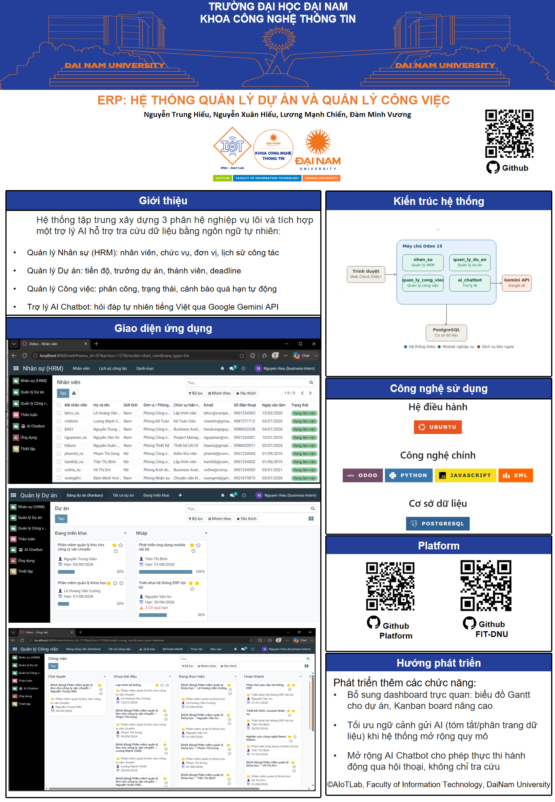
    </a>
</p>

📌 Poster trình bày tổng quan về kiến trúc hệ thống, các phân hệ chính và tính năng nổi bật của dự án.


---

## ⚙️ Các phân hệ chính

### 1. Quản lý Nhân sự (`nhan_su`)
- Quản lý thông tin nhân viên, chức vụ, đơn vị/phòng ban
- Theo dõi lịch sử công tác và chứng chỉ của từng nhân viên
- Là dữ liệu nền tảng dùng chung cho phân hệ Dự án, Công việc và AI Chatbot

### 2. Quản lý Dự án (`quan_ly_du_an`)
- Quản lý dự án từ khởi tạo đến hoàn thành: mã dự án, trưởng dự án, thành viên tham gia
- Tự động tính tiến độ dự án (%) dựa trên số công việc đã hoàn thành
- Wizard đề xuất bằng AI hỗ trợ lập kế hoạch dự án nhanh hơn
- Liên kết chặt chẽ với phân hệ Nhân sự và Công việc

### 3. Quản lý Công việc (`quan_ly_cong_viec`)
- Quản lý công việc chi tiết trong từng dự án, gán người phụ trách và deadline
- Tự động cảnh báo công việc quá hạn (`la_qua_han`)
- Wizard phân công công việc hàng loạt cho nhiều nhân viên cùng lúc
- Báo cáo thống kê khối lượng công việc theo từng nhân viên

### 4. Trợ lý AI Chatbot (`ai_chatbot`)
- Cho phép đặt câu hỏi bằng tiếng Việt tự nhiên (VD: *"Dự án nào đang chậm tiến độ?"*, *"Ai đang có nhiều việc quá hạn nhất?"*)
- Thu thập dữ liệu thời gian thực từ cả 3 phân hệ HRM – Dự án – Công việc làm ngữ cảnh trả lời
- Tích hợp Google Gemini API, hỗ trợ hội thoại nhiều lượt (multi-turn) và cơ chế tự phục hồi khi máy chủ AI quá tải
- Cấu hình API Key và lựa chọn model AI tập trung, không cần chỉnh sửa mã nguồn

---

## 📸 Giao diện & Chức năng


### Phân hệ Quản lý Dự án
Quản lý toàn diện dự án, thành viên và tiến độ.

| Danh sách Dự án | Form Dự án |
|:---:|:---:|
| 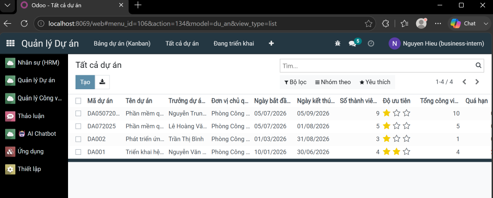 | 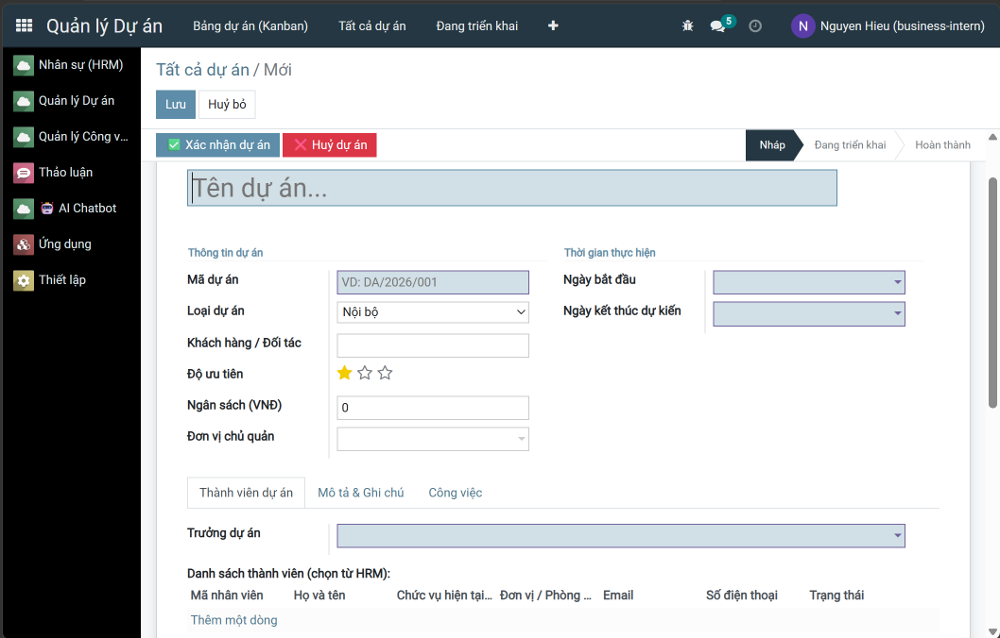 |
| *Danh sách dự án với trạng thái* | *Chi tiết dự án với thành viên và tiến độ* |

| Kanban Dự án |
|:---:|
 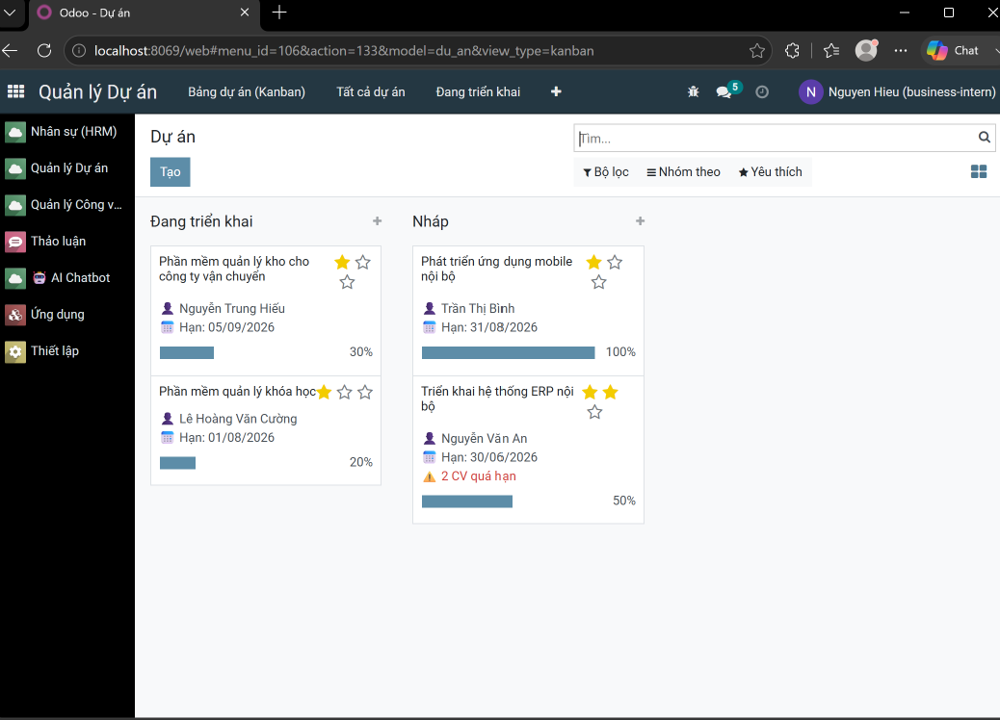 
| *View kanban theo trạng thái, thanh tiến độ trên từng thẻ* |
### Phân hệ Quản lý Công việc
Quản lý nhiệm vụ chi tiết và theo dõi tiến độ.

| Danh sách Công việc | Kanban Công việc |
|:---:|:---:|
| 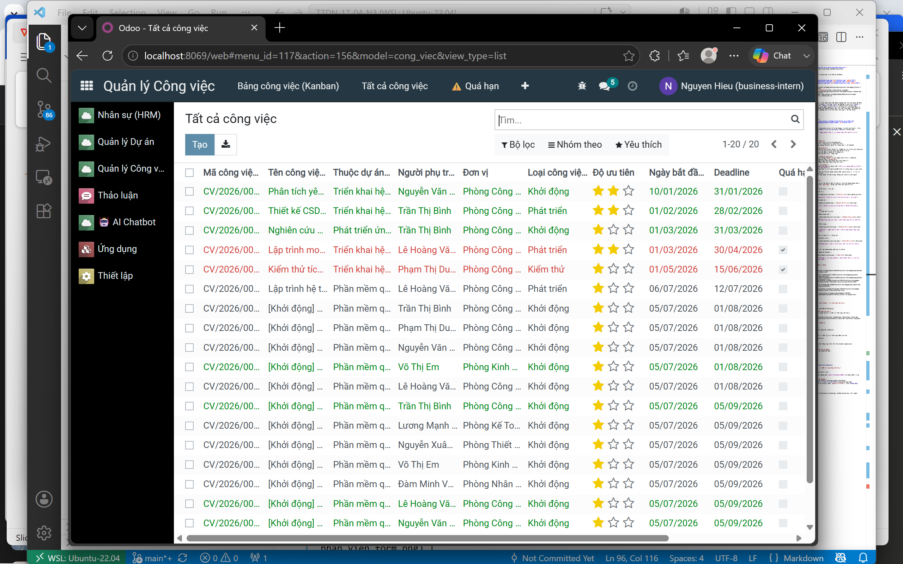 | 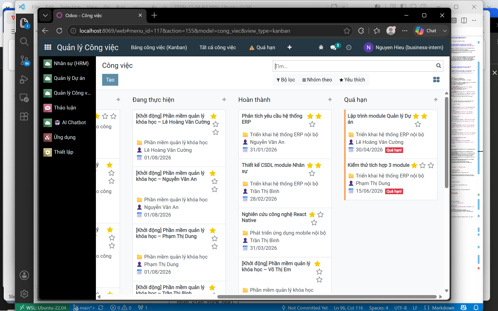 |
| *Danh sách công việc, đánh dấu công việc quá hạn* | *Thẻ công việc tô màu cảnh báo khi quá hạn* |

| Form Công việc | Wizard Phân công |
|:---:|:---:|
| 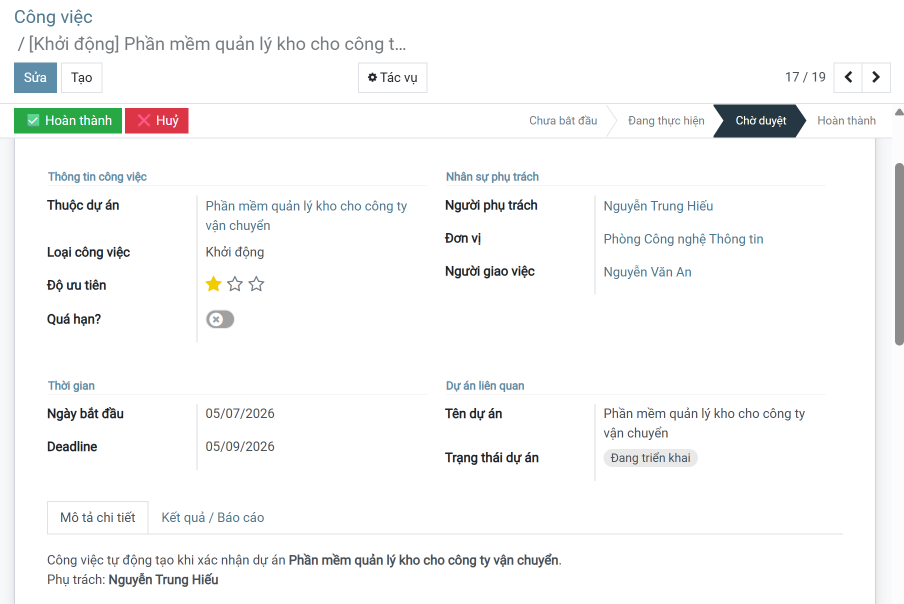 | 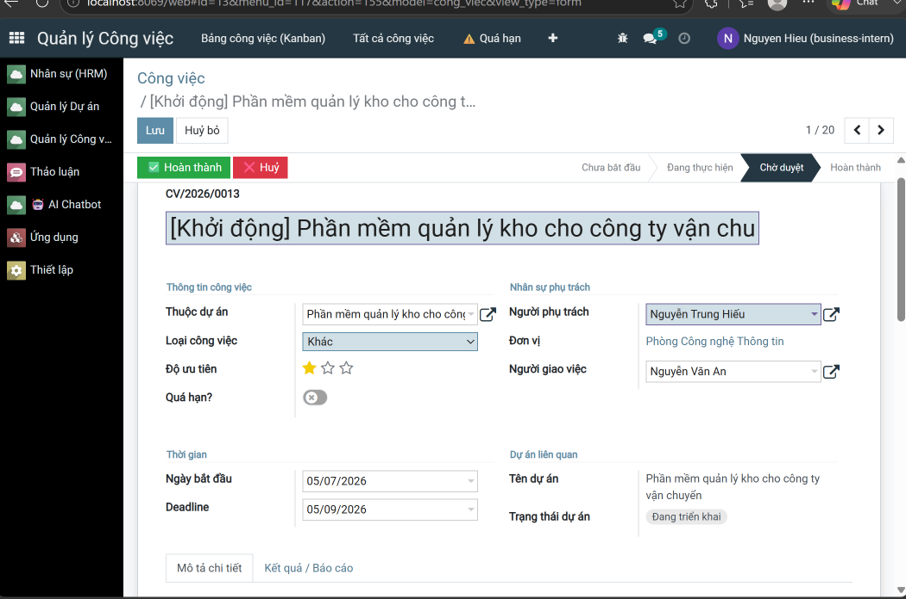 |
| *Chi tiết công việc với deadline và người phụ trách* | *Phân công nhiều công việc cho nhiều nhân viên cùng lúc* |

### Phân hệ Nhân sự (HR)
Quản lý hồ sơ nhân sự, lịch sử công tác và chứng chỉ.

| Danh sách Nhân viên | Form Nhân viên |
|:---:|:---:|
| 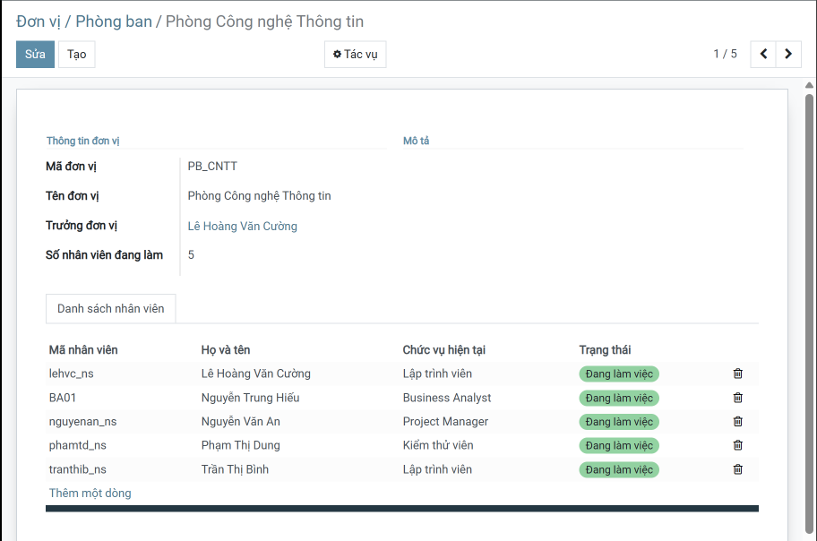 | 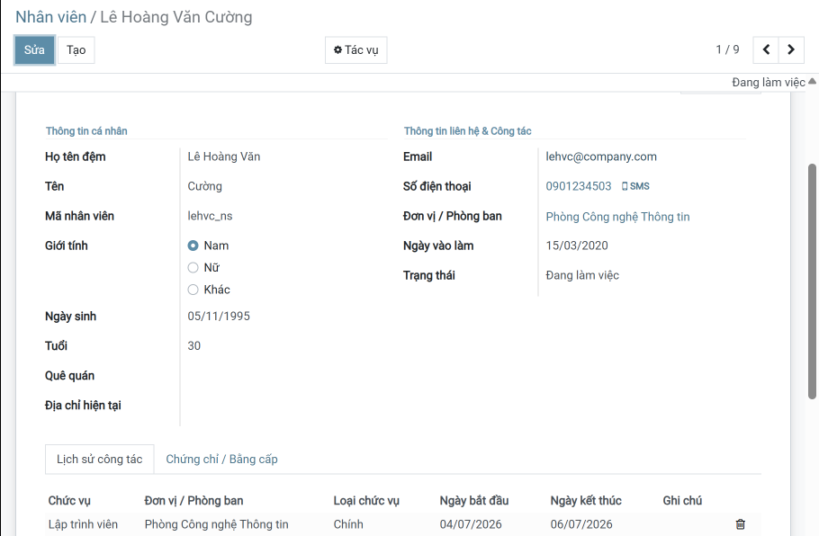 |
| *Danh sách nhân viên theo phòng ban* | *Hồ sơ nhân viên: chức vụ, đơn vị, lịch sử công tác, chứng chỉ* |

### Phân hệ AI Chatbot
Trợ lý AI tra cứu dữ liệu toàn hệ thống bằng ngôn ngữ tự nhiên.

| Cấu hình API Key | Hội thoại AI Chatbot |
|:---:|:---:|
| 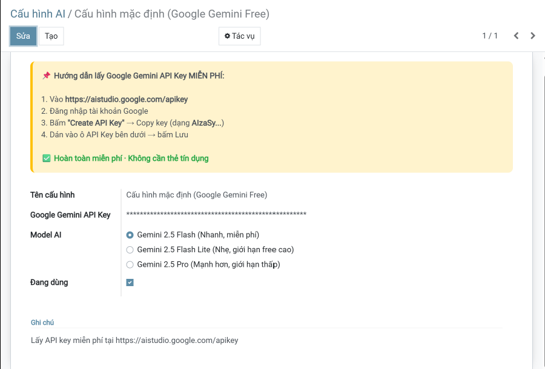 | 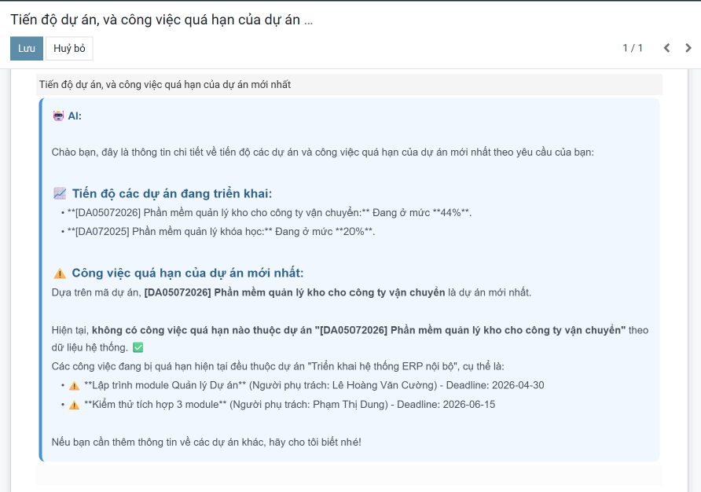 |
| *Cấu hình Google Gemini API Key và lựa chọn model* | *Hội thoại thực tế: tra cứu tiến độ dự án, công việc quá hạn* |

---

## 🔧 2. Các công nghệ được sử dụng
<div align="center">

### Hệ điều hành
[](https://ubuntu.com/)
### Công nghệ chính
[](https://www.odoo.com/)
[](https://www.python.org/)
[](https://developer.mozilla.org/en-US/docs/Web/JavaScript)
[](https://www.w3.org/XML/)
### Cơ sở dữ liệu
[](https://www.postgresql.org/)
### Trợ lý AI
[](https://ai.google.dev/gemini-api/docs)
</div>

## ⚙️ 3. Cài đặt

### 3.1. Cài đặt công cụ, môi trường và các thư viện cần thiết

#### 3.1.1. Tải project
```
git clone https://github.com/TTDN-17-04-N3.git
```
#### 3.1.2. Cài đặt các thư viện cần thiết
Người sử dụng thực thi các lệnh sau để cài đặt các thư viện cần thiết

```
sudo apt-get install libxml2-dev libxslt-dev libldap2-dev libsasl2-dev libssl-dev python3.10-distutils python3.10-dev build-essential libssl-dev libffi-dev zlib1g-dev python3.10-venv libpq-dev
```
#### 3.1.3. Khởi tạo môi trường ảo
- Khởi tạo môi trường ảo
```
python3.10 -m venv ./venv
```
- Thay đổi trình thông dịch sang môi trường ảo
```
source venv/bin/activate
```
- Chạy requirements.txt để cài đặt tiếp các thư viện được yêu cầu
```
pip3 install -r requirements.txt
```
### 3.2. Setup database

Khởi tạo database trên docker bằng việc thực thi file docker-compose.yml.
```
sudo docker-compose up -d
```
### 3.3. Setup tham số chạy cho hệ thống
Tạo tệp **odoo.conf** có nội dung như sau:
```
[options]
addons_path = addons
db_host = localhost
db_password = odoo
db_user = odoo
db_port = 5431
xmlrpc_port = 8069
```
Có thể kế thừa từ file **odoo.conf.template**

### 3.4. Chạy hệ thống và cài đặt các ứng dụng cần thiết
Lệnh chạy
```
python3 odoo-bin.py -c odoo.conf -u all
```
Người sử dụng truy cập theo đường dẫn _http://localhost:8069/_ để đăng nhập vào hệ thống.

### 3.5. Cấu hình Trợ lý AI Chatbot
1. Lấy API Key miễn phí tại: https://aistudio.google.com/apikey
2. Vào menu **🤖 AI Chatbot → ⚙️ Cấu hình API Key** trong giao diện Odoo
3. Dán API Key, chọn model AI (khuyến nghị `gemini-2.5-flash`), tick **Đang dùng (active)** và Lưu

---

## 📝 4. License

© 2024 AIoTLab, Faculty of Information Technology, DaiNam University. All rights reserved.

---
